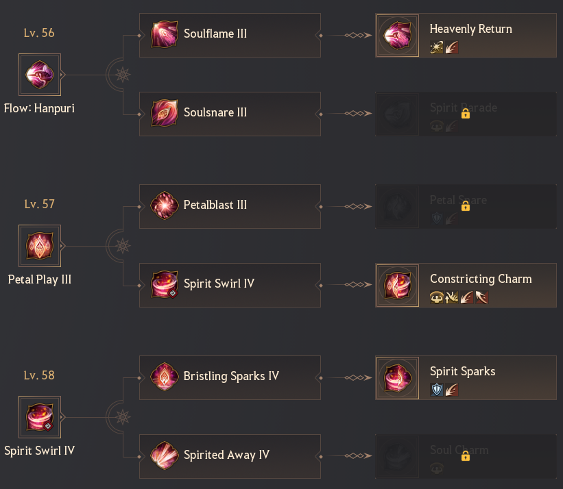
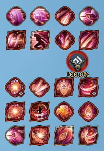
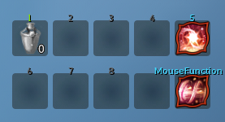
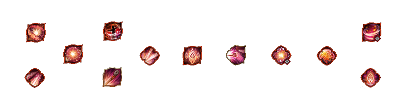
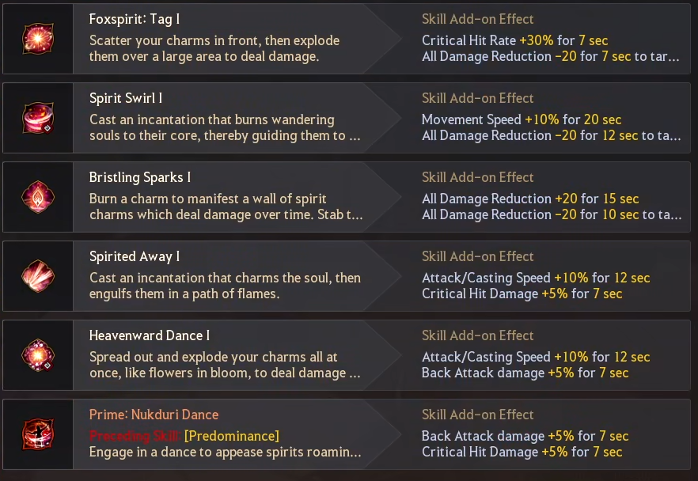

# Discord — PvE (Source of Truth)

> Verbatim copy/paste from the succession Maegu Discord (PvE sections). This is 100% source of
> truth for PvE. Ability names are encoded as Discord emoji shortcodes (e.g. `:P_Foxspirit_Tag:`)
> — treat each shortcode as the canonical identifier for that ability/input.
>
> Provenance notes embedded in the paste: posts dated 8/29/25, 10/3/25, and references a
> dedicated cancels sheet (linked at the bottom).

---

## Abilities

Locked 🔒
- :Evasion: Evasion
- :Petal_Blast: (preference) this spell is absolute trash and I would very rarely use it by accident

Quick Slot
- :Foxspirit_Form: Foxspirit Form
- :Soul_Charm: Soul Charm (If taken)

### Buffs
- +20 AP | :Charmed: (Space) :P_Nukduri_Dance: (Shift+C) :Flow_Nether_River: (LMB flow) | These don't stack with each other
- +25 AP | :Foxspirit_Form: (Slot) | 3 minute CD - Overwrites above so effectively +5 AP

### Debuffs (Excluding CC and DoT)
- -20 DP | :P_Foxspirit_Tag: (RMB)

### Movement
- :Spirit_Step: :Chain_Spirit_Step: (Shift+Direction) | Your PvE Iframes - relatively slow animation
- :P_Soul_Tear: (W+Q) | Fastest and most efficient movement in the kit
- :Path_Of_Petals: (W+F) | Good long distance movement, can go down ledges without fall animation
- :P_Lurking_Claws: (S+F) | Targeted teleport, places you behind target - very fast when you can use it effectively
- :P_Ghost_Bomb: (A/D+RMB) | Short dash to the side with Iframe
- :Flow_Hanpuri: (E/F flow) | Targeted teleport towards target

Generally :P_Soul_Tear: is the best choice for medium distance.
:P_Lurking_Claws: and :Flow_Hanpuri: are very fast targeted teleports from short-medium distance.

Example long range movement combo:
:Chain_Spirit_Step::Spirit_Step::P_Soul_Tear::Path_Of_Petals::Chain_Spirit_Step::Spirit_Step::P_Soul_Tear:
Ghost bomb :P_Ghost_Bomb: and :P_Flower_Shroud: can be added for slightly more distance.

### Repositioning
- :P_Heavenward_Dance: (W+RMB) | Short dash forward, no collision, great DPS
- :P_Lurking_Claws: (S+F) | Targeted teleport behind, good DPS, very fast
- :P_Flower_Shroud: (W/S+E) | Short dash forward or backward, decent DPS
- :P_Bared_Claws: (A/D+LMB) | Short side dash, low DPS

Clone swap :13Foxspirit_Deceiver: (Q) is very powerful for repositioning with planning too as it can be used while in most other animations.

### Skill Enhancements (a.k.a. Rabams)
Lv. 56
- :Heavenly_Return: best choice for PvE, fast and decent damage. Used in Hanpuri :Flow_Hanpuri: E flow combos or can be used on it's own for quick backstep with good damage. Fast enough that no protection is rarely an issue.
- :Spirit_Parade: does less damage for a longer animation but useful choice if you want a protected option instead.

Lv. 57
- :Petal_Snare: Long and low DPS.
- :Constricting_Charm: decent filler when nothing else is available with very high attack speed. Also flows into :Spirit_Sparks:.

Lv. 58
- :Spirit_Sparks: weak on it's own but decent follow-up used with :Constricting_Charm: above. Only really useful as filler with nothing else available.
- :Soul_Charm: not useful in PvE. Only useful to recover some HP outside of combat or during downtime but costs stamina for very little healing.

> Image: rabam tree. Lv56 → Heavenly Return (from Soulflame III). Lv57 → Constricting Charm (from Spirit Swirl IV). Lv58 → Spirit Sparks (from Bristling Sparks IV).

### Magnus Skill - Foxflare Fling
Magnus skill has 2 components:
- Long frontal guard windup
- Long range line attack

The FG windup is pretty useless in PvE but it's skippable from several skills including:
:P_Foxflare::P_Foxspirit_Tag::P_Petal_Play::P_Flower_Shroud: (and probably some others)

The damage component mentions 3 max hits. I believe this works similar to a few other line multihit skills in the game where there are different segments to the attack that can hit separately. This means you are almost never getting all 3 of the hits. It's MAYBE possible to get all 3 against large targets such as bosses in black shrine although I haven't tested it.

The damage with 1 hit is exceptionally bad, 2 hits is still bad and 3 is decent.
Due to it's inconsistency I would recommend just ignoring it for PvE - I leave it unlearned to still be able to use Soulflame instead.

TL:DR Magnus very bad leave it unlearned.

### Example Skill UI
The way I setup my abilities is usually movement/utility in the top 8 and DPS abilities in DPS priority in the bottom 12 (left to right > top to bottom)

> Image: the author's hotbar — 8 movement/utility icons on top, 12 DPS icons below.

> Image: quickslot bar — Foxspirit Form on slot 0, MouseFunction on slot 5.

> Image: horizontal row of ability icons (layout/addon reference).

---

## Netherax [𝟋ox] — 8/29/25, 8:18 PM

### Earlygame 1-shot spots
These spots are mostly about moving and aiming to hit many monsters

Ranged spells
- :P_Foxflare: (Shift+Q)
- :P_Spirited_Away: (S+LMB)
- :P_Petal_Play: (Shift+LMB) Faster after :P_Spirited_Away: S+LMB or :P_Bared_Claws: D+LMB (atk 1)
- :P_Flower_Shroud: (W/S+E) Smaller AoE than others
- :P_Bared_Claws: (A/D+LMB) Careful spamming this too much, eats stamina!

Big frontal AoEs
- :P_Foxspirit_Tag: (RMB)
- :P_Bristling_Sparks: (Shift+RMB)

Closer range AoEs
- :P_Spirit_Swirl: (Shift+F)
- :P_Nukduri_Dance: (Shift+C)
- :P_Heavenward_Dance: (W+RMB)

Use :P_Soul_Tear: (W+Q) and :Path_Of_Petals: (W+F) to get between packs. Move to places where you can ranged many monsters!
(⚠️ Advanced) Use :Flow_Hanpuri: (E after :P_Ghost_Bomb: A/D+RMB, :Soulflame: E or :Soulsnare: F) and :P_Lurking_Claws: (S+F) for very fast movement between packs.

### Short combos for midgame
You could use the endgame combo below but short combos are generally most useful for midgame.

Disclaimer: I would recommend using DPS prioritisation below instead for better results when you're comfortable on the class.

Combos
- (:P_Flower_Shroud:/:P_Bared_Claws:):P_Foxspirit_Tag::P_Spirited_Away::P_Petal_Play:
  (W/S+E or A/D+LMB) -> RMB -> S+LMB -> Shift+LMB
- :P_Heavenward_Dance::P_Nukduri_Dance::P_Spirit_Swirl:
  W+RMB -> Shift+C -> Shift+F
- (:P_Flower_Shroud:/:P_Bared_Claws:):P_Foxspirit_Tag::P_Bristling_Sparks:
  (W/S+E or A/D+LMB) -> RMB -> Shift+RMB

Use :P_Soul_Tear: (W+Q) and :Path_Of_Petals: (W+F) to get between packs.
Use :P_Flower_Shroud: (W/S+E) and :P_Bared_Claws: (A/D+LMB) between short combos to reposition.
Use :P_Foxflare: (Shift+Q) for big ranged AoE.
(⚠️ Advanced) Use :Flow_Hanpuri: (E after :P_Ghost_Bomb: A/D+RMB, :Soulflame: E or :Soulsnare: F) and :P_Lurking_Claws: (S+F) for very fast movement between packs.

ℹ️ :P_Bared_Claws: (A/D+LMB) -> :P_Foxspirit_Tag: (RMB) is a non-symmetrical cancel. See notable cancels below.

### Combo for Lazy grind/Tanky mobs/Endgame
Loopable combo for new/lazy players at tanky spots.

Disclaimer: I would recommend using DPS prioritisation below instead for better results when you're comfortable on the class.

Full Combo
(:P_Flower_Shroud:/:P_Bared_Claws:):P_Foxspirit_Tag:(:P_Nukduri_Dance:/:Charmed:):P_Spirited_Away::P_Petal_Play:{:Heavenly_Return:}:P_Heavenward_Dance:{:P_Foxflare:}(:P_Spirit_Swirl:/:P_Bristling_Sparks:)
(W/S+E or A/D+LMB) -> RMB -> (Shift+C or Space) -> S+LMB -> Shift+LMB -> {Shift+X} -> W+RMB -> {Shift+Q} -> (Shift+F or Shift+RMB)

Optional spells in { } should be added if you have high attack speed e.g. BSR or shai buffs.
If you still run out of spells add :Constricting_Charm:->:Spirit_Sparks: (Shift+Z->LMB)

Loops without optional spells included
- (:P_Flower_Shroud:/:P_Bared_Claws:):P_Foxspirit_Tag::P_Nukduri_Dance::P_Spirited_Away::P_Petal_Play::P_Heavenward_Dance::P_Spirit_Swirl:
  (W/S+E or A/D+LMB) -> RMB -> Shift+C -> S+LMB -> Shift+LMB -> W+RMB -> Shift+F
- (:P_Flower_Shroud:/:P_Bared_Claws:):P_Foxspirit_Tag::Charmed::P_Spirited_Away::P_Petal_Play::P_Heavenward_Dance::P_Bristling_Sparks:
  (W/S+E or A/D+LMB) -> RMB -> Space -> S+LMB -> Shift+LMB -> W+RMB -> Shift+RMB

Notes
- Use :P_Lurking_Claws: (S+F) anywhere in the combo (except between :P_Spirited_Away::P_Petal_Play:) for repositioning to get back attacks.
- (:P_Flower_Shroud:/:P_Bared_Claws:) is just a movement choice - they do similar DPS.
- Both spells accelerate :P_Foxspirit_Tag: but :P_Bared_Claws: is asymmetrical about the cancel, see notable cancels below.
- AP buff from :P_Nukduri_Dance:/:Charmed: isn't important if you're over a spot cap. :P_Nukduri_Dance: is still good DPS but you can skip :Charmed: if you're over the cap.

### DPS Priority List
Prioritise higher spells on the list for DPS. Remember to apply -DP at the beginning!

- Top Priority: :P_Heavenward_Dance: / :P_Spirited_Away::P_Petal_Play: / :P_Spirit_Swirl:
- Core DPS: :P_Foxflare: / :P_Nukduri_Dance: / :P_Lurking_Claws: / :P_Bristling_Sparks: / (:P_Flower_Shroud:|:P_Bared_Claws:):P_Foxspirit_Tag: (Top prio if applying -DP) / :P_Flower_Shroud:
- Filler: :Heavenly_Return: / :Constricting_Charm:[:Spirit_Sparks:] / :Soulflame::Flow_Hanpuri: / :Soulsnare::Flow_Hanpuri:

Use higher priority stuff as they come off cooldown. Setup your UI by priority like I do (shown above) to make it easier.
Remember to consider AoE.
:P_Nukduri_Dance: and :Charmed: (as backup) are your AP buffs. Only relevant when you're below AP cap.

### Notable Cancels
- :Petal_Play: (Shift+LMB) | Faster after :P_Spirited_Away: (S+LMB) / :P_Bared_Claws: (D+LMB attack 1/A+LMB attack 2, this cancel is asymmetrical)
- :P_Foxspirit_Tag: (RMB) | Faster after :P_Flower_Shroud: (W/S+E attack 1) / :P_Bared_Claws: (D+LMB attack 1/A+LMB attack 2, this cancel is asymmetrical)
- :Heavenly_Return: (Shift+X) | Faster into :P_Heavenward_Dance: (W+RMB) - cancels a small linger
- :Soulsnare: (F) | Fast into :P_Bared_Claws: (A/D+LMB) or :Flow_Hanpuri: (F/E)
- :P_Flower_Shroud: (W/S+E) | Attack 2 can be cancelled by many spells. I'll often use it to reposition or accelerate :P_Foxspirit_Tag: (RMB)
- :P_Spirit_Swirl: (Shift+F) | Can be cancelled midway by :P_Heavenward_Dance: (W+RMB) but generally not advisable as it's a high DPS spell
- :P_Bared_Claws: (A/D+LMB) | Can cancel most things - I use it as a cancel often, notably for :P_Bristling_Sparks: (Shift+RMB)
- :P_Soul_Tear: (W+Q) | Can cancel most things - notably any point of :Path_Of_Petals:
- :P_Ghost_Bomb: (A/D+RMB) | Can cancel most things - notably any point of :Path_Of_Petals:
- :Path_Of_Petals: (W+F) | Can cancel most things

Slow Casts - avoid these
- :P_Spirit_Swirl: (Shift+F) | Slow when cast from idle - use anything before it

Input Traps
- :Charmed: (Space) | Pressing space without using a spell before it will make you jump
- :P_Lurking_Claws: (S+F) | Failing to hold the input until you teleport behind the target of attack 2 will prevent you from teleporting

Full info about Succession Maegu cancels: https://docs.google.com/spreadsheets/d/115Q8_SoUFiCCZzoiWgkOeNKf0ERQk23ZFElSv6WC22s/edit#gid=864274794

DPS Sheet: https://docs.google.com/spreadsheets/d/1F6D6zCWd7w0hgTnKrtvrPxVEqMj5qT2-sXdbXvXc1UQ/edit?usp=sharing

---

## Netherax [𝟋ox] — 10/3/25, 1:11 PM

### General Purpose Addons (new 03/10/25)
Several flexible options:
Nukduri dance could be swapped to something else. I put special attack as I frequently use it early from habit using it as AP buff.

For Midgame where you want more -DP options I would typically:
- Swap :P_Spirited_Away: to :P_Foxflare: with -DR/Attack Speed
- Swap :P_Bristling_Sparks: +DR to Crit Dmg
- Swap :P_Nukduri_Dance: to :Petal_Play: with -DR/Crit Dmg

> Image: PvE skill addon setup. Skills with addons: Foxspirit Tag, Spirit Swirl, Bristling Sparks,
> Spirited Away, Heavenward Dance, Prime Nukduri Dance [Predominance]. (Exact addon values are in
> the image — low source resolution, read the image directly rather than trusting a transcription.)
