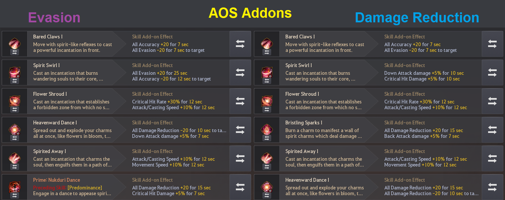

# Discord — PvP (Starting Point, currency uncertain)

> Verbatim copy/paste from the succession Maegu Discord (PvP sections). Unlike the PvE material,
> the user is NOT sure how up to date this is — treat it as a strong starting point, not locked
> source of truth, and flag anything that looks stale. Ability names are Discord emoji shortcodes
> (e.g. `:P_Foxspirit_Tag:`). Combos credited to Bantalope. Several entries reference images/clips
> ("Magnus Variation", "Lurking Variation", etc.) that did not come through in the paste.

---

## PvP Playstyle
Succgus default PvP is centred around long range AOE CC's and melee burst damage and due to this it changes how your engages will work.

During fights you will have to decide how close to an enemy you can get as well as how long you can trade an opponent, something that will HIGHLY vary dependent on build.

In 1v1 you may have to take riskier CC's with clone swaps such as baiting a chase with :P_Soul_Tear: to get a stiff hit on their back or a mid swap :P_Foxflare: and might find yourself walled by certain characters making many matchups pure skill matchups.

In Group fighting of ANY scale it changes dependent on your build or mode caps, you have to learn your limits of how long you can spend in a fight and know when to engage/disengage, and sometimes just rotating some CC's and ranged DPS skills without ever engaging into a ball IS the better option to just aid allied CC's; however when engaging you generally want to stay as protected as possible before getting out again.

Utilising clone swaps to keep yourself alive and keep consistent pressure on an opponent is the name of the game, kiting grabs and baiting skills onto your clone when possible, try to not fall into the habit of ignoring the clone mechanic and just using :P_Bared_Claws: on repeat and utilise actual cancels where possible.

---

## Flower Shroud Combos
_Courtesy of Bantalope_

- :P_Flower_Shroud::P_Lurking_Claws::P_Bared_Claws::P_Foxspirit_Tag::foxflare_fling::P_Foxflare::Spirit_Parade::P_Heavenward_Dance::P_Nukduri_Dance::P_Spirit_Swirl:
- :P_Flower_Shroud::P_Lurking_Claws::P_Bared_Claws::P_Foxspirit_Tag::Charmed::P_Foxflare::Spirit_Parade::P_Heavenward_Dance::P_Nukduri_Dance::P_Spirit_Swirl:
- :Flower_Shroud::P_Spirited_Away::foxflare_fling::P_Foxflare::P_Lurking_Claws::P_Nukduri_Dance::P_Heavenward_Dance::P_Spirit_Swirl:

Input notation:
- W/S+E > S+F > D+LMB > RMB > E > SHIFT+Q > SHIFT+X > W+RMB > SHIFT+C > SHIFT+F
- W/S+E > S+F > D+LMB > RMB > SPACE > SHIFT+Q > SHIFT+X > W+RMB > SHIFT+C > SHIFT+F
- W/S+E > S+LMB > E > SHIFT+Q > S+F > SHIFT+C > W+RMB > SHIFT+F

Primarily used in isolated environments or small scale due to the re-CC gap during the :Charmed:/:foxflare_fling: > :P_Foxflare: portion of the combo, this offers some of the highest damage burst you can get out on a single target.

The :P_Spirited_Away: variation is more fit for largescale environments since post engage you are fully SA until you choose to leave the fight.

:P_Flower_Shroud: can be inconsistent on its first hit if the initial hit was dragged onto the enemy as opposed to hitting them directly so this combo can also be done off of hit 2.

:foxflare_fling: is the higher damage option between :foxflare_fling: and :Charmed: but due to it having no verticality, :Charmed: should be used in uneven terrain.

Depending on the angle you end up at near your opponent you can also use :Spirit_Parade: to move yourself behind the opponent for 100% back attacks on :P_Heavenward_Dance:.

Variations (referenced, clips not included): Magnus Variation, Charmed Variation, Spirited Away Variation.

---

## Bristling Combos
_Courtesy of Bantalope_

- :P_Bristling_Sparks::P_Bared_Claws::P_Foxspirit_Tag::Charmed::P_Foxflare::P_Heavenward_Dance::P_Nukduri_Dance::P_Spirit_Swirl:
- :P_Bristling_Sparks::P_Bared_Claws::P_Foxspirit_Tag::Charmed::P_Foxflare::P_Lurking_Claws::P_Nukduri_Dance::P_Heavenward_Dance:
- :P_Bristling_Sparks::P_Bared_Claws::P_Foxspirit_Tag::Charmed::P_Flower_Shroud::P_Spirited_Away::P_Petal_Play:

Input notation:
- SHIFT+RMB > D+LMB > RMB > SPACE/E > SHIFT+Q > W+RMB > SHIFT+C > SHIFT+F
- SHIFT+RMB > D+LMB > RMB > SPACE/E > SHIFT+Q > S+F > SHIFT+C > W+RMB
- SHIFT+RMB > D+LMB > RMB > SPACE > S+E > S+LMB > SHIFT+LMB

These combos are generally combos that focus on keeping you in SA due to :P_Bristling_Sparks: being a short-midrange CC or distancing yourself like in the :P_Flower_Shroud: variation; you should always decide if you'll die by full committing to the combo and pick the safest option.

As with the :P_Flower_Shroud: combos, :Charmed: and :foxflare_fling: are interchangeable depending on environment so use :foxflare_fling: for higher damage when possible apart from the :P_Flower_Shroud: as it lasts for slightly longer so can put you more at risk.

Variations (referenced, clips not included): Foxflare Variation, Lurking Variation, Flower Shroud Variation.

---

## Hanpuri Combos
_Courtesy of Bantalope_

- :P_Flower_Shroud::Soulsnare::Flow_Hanpuri::Spirit_Parade::Charmed::P_Foxflare::P_Lurking_Claws::P_Bared_Claws::P_Foxspirit_Tag::P_Nukduri_Dance::P_Heavenward_Dance:
- :P_Flower_Shroud::Soulsnare::Flow_Hanpuri::Spirit_Parade::Charmed::P_Foxflare::P_Heavenward_Dance::P_Nukduri_Dance::P_Spirit_Swirl:

Input notation:
- W/S+E > F(Hold) > SPACE > SHIFT+Q > S+F > D+LMB > RMB > SHIFT+C > W+RMB
- W/S+E > F(Hold) > SPACE > SHIFT+Q > W+RMB > SHIFT+C > SHIFT+F

Great for a backpedal CC and can be adapted/shortened for full protection when playing with an ally that can re-CC for you.

When shortening or adjusting it for full SA generally you should do :P_Heavenward_Dance: or :P_Lurking_Claws: immediately after :Spirit_Parade: to keep constant DPS while an ally does the re-CC.

For protection reasons, this combo is done with :Spirit_Parade: over :Heavenly_Return:.

Due to the combo going from :Flow_Hanpuri: > :Spirit_Parade: you have to use :Charmed:. :foxflare_fling: is NOT interchangeable.

Variations (referenced, clips not included): Lurking Variation, Heavenward Variation.

---

## Stiff/Foxflare Combos
_Courtesy of Bantalope_

- :Charmed::P_Foxflare::P_Spirited_Away::P_Petal_Play::P_Lurking_Claws::P_Nukduri_Dance::P_Heavenward_Dance:
- :Charmed::P_Foxflare::P_Spirited_Away::P_Petal_Play::Soulsnare::Flow_Hanpuri::Spirit_Parade::P_Heavenward_Dance::P_Nukduri_Dance:
- :P_Soul_Tear::P_Foxflare::P_Lurking_Claws::P_Bared_Claws::P_Petal_Play::P_Nukduri_Dance::P_Heavenward_Dance::P_Spirit_Swirl:

Input notation:
- (SPACE >) SHIFT+Q > S+LMB > SHIFT+LMB > S+F > SHIFT+C > W+RMB
- (SPACE >) SHIFT+Q > S+LMB > SHIFT+LMB > F(Hold) > W+RMB > SHIFT+C
- (W+Q/SPACE >) SHIFT+Q > S+F > D+LMB > SHIFT+LMB > SHIFT+C > W+RMB > SHIFT+F

All variations that can be done off of a stiff from :Charmed: or a :P_Soul_Tear: clone bait.

Due to :P_Foxflare: being a KD, the only reliable re-CC is :P_Petal_Play: hence why it's seen in all 3 combos.

During large scale it's quite often you might only do portions of this combo or something like the first combo going from full range to inside a ball next to your target, staying in SA and then getting out so always know when you might need to abort the combo to escape with :Spirit_Step:, :P_Ghost_Bomb: and :P_Soul_Tear:/:Path_Of_Petals:.

Variations (referenced, clips not included): Lurking Variation, Hanpuri Variation, Petal Play Variation.

---

## Primary Cancels (PvP)

:P_Foxspirit_Tag: can be cancelled into from:
- :P_Bared_Claws: (One hit to the right or two hits to the left)
- :P_Flower_Shroud:
- :Spirit_Step: (One dash left)

:P_Petal_Play: can be cancelled into from:
- :P_Bared_Claws: (One hit to the right or two hits to the left)
- :P_Spirited_Away:

:foxflare_fling: can be cancelled into from:
- :P_Foxspirit_Tag:
- :P_Spirited_Away:
- :P_Foxflare:
- :P_Petal_Play:
- :P_Flower_Shroud:

:P_Ghost_Bomb: and :P_Bristling_Sparks: can be cancelled out into:
- :Spirit_Step:/:Chain_Spirit_Step:
- :P_Bared_Claws:
- :P_Soul_Tear:

There are many other smaller cancels that will occur naturally such as most skills flowing into :P_Spirit_Swirl: and :P_Bristling_Sparks: but the ones listed above are some of the main ones to keep in mind.

---

## PvP - Addons
First and foremost, addons are subjective and will depend on your personal playstyle and how you utilise the class.

That out of the way, the below addons are built to utilise certain aspects of a playstyle and cover as many combos as possible, such as DR having addons for :P_Spirited_Away: to fill in combos from :P_Foxflare: that don't utilise :P_Bared_Claws:.

Due to the tankier setup of evasion builds, HP regen on :P_Nukduri_Dance: can actually give a tremendous chunk of HP due to it already having HP regen and being able to hit 10 targets, and an eva setup rotating SA within a fight can utilise this far more than a DR setup.

The capped setup will look different to what people are used to, with self buffs and debuffs now counting and DP debuffs applying from the max cap rather than spare stats, this means upkeeping your DR, evasion and accuracy is more important than it was before as well as debuffing those around you.

These addons can and should be changed if you find yourself utilising certain skills more than others but for a general purpose these should fit most playstyles.

Addon profiles (referenced): DR, Evasion, Capped, AOS. _Courtesy of Bantalope._

> Image: AOS addon chart, two columns — Evasion build vs Damage Reduction build — listing the addon
> per skill (Bared Claws, Spirit Swirl, Flower Shroud, Heavenward Dance, Spirited Away, Bristling
> Sparks, Prime Nukduri Dance, etc.). Read the image directly for exact per-skill values.
> Still missing: the DR, Evasion, and Capped standalone profile images.
