# Video Guide — PvE (Source of Truth)

> Transcribed from the guide video (https://www.youtube.com/watch?v=IhLoxr07buM), via 26
> screenshots in `video-screenshots/`. **100% source of truth for PvE.** Each section links the
> screenshot it came from. Transcription is faithful to the slides; where the slide shows an icon
> sequence, the input keys are written out.

---

## Setup — Skills, Addons, Reforge Stones

### Skills: what to lock / not learn
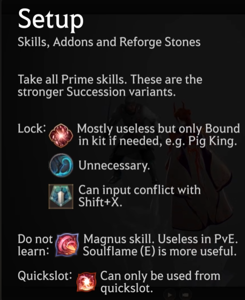

Take all **Prime** skills — these are the stronger Succession variants.

- **Lock:** Pig King — mostly useless but only Bound in kit if needed. *(Identified 2026-06-11:
  this is Petalblast — the kit's only Bound; "Pig King" is the boss you'd unlock it for.)*
- **Lock:** (one marked) Unnecessary. *(Identified by icon match: Evasion.)*
- **Lock:** (one marked) Can input-conflict with Shift+X. *(Identified by user 2026-06-11:
  Rage Transfer — common BSR skill on X.)*
- **Do not learn:** Magnus skill — useless in PvE, Soulflame (E) is more useful.
- **Quickslot:** (skill) can only be used from quickslot.

### Rabams (Skill Enhancements)
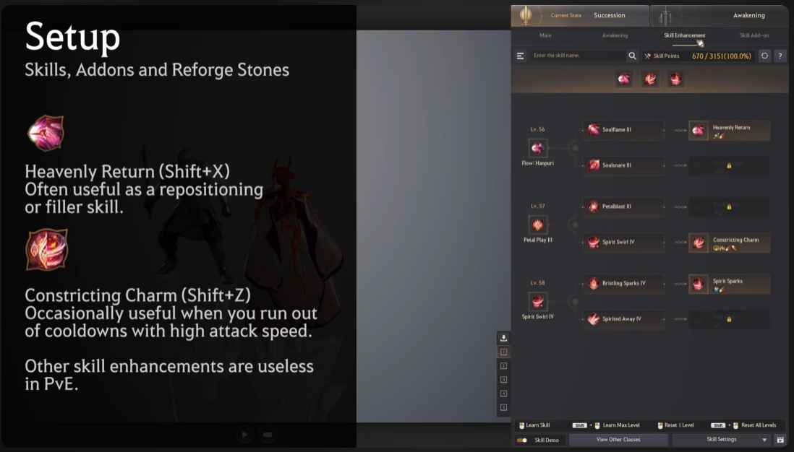

- **Heavenly Return (Shift+X)** — often useful as a repositioning or filler skill.
- **Constricting Charm (Shift+Z)** — occasionally useful when you run out of cooldowns (high attack speed).
- Other skill enhancements are useless in PvE.
- (Slide shows the in-game skill enhancement tree — matches `discord-images/pve/rabams-lv56-58.png`.)

### General-purpose addons
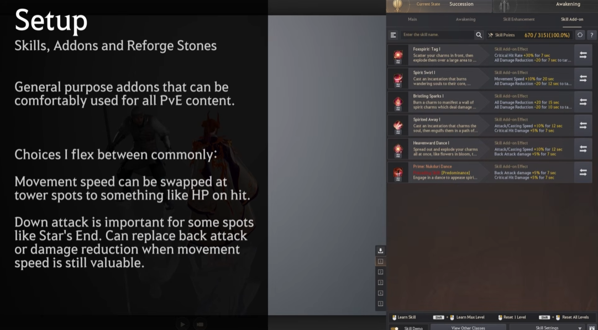

General-purpose addons can be comfortably used for all PvE content. Choices flexed between commonly:
- **Movement speed** can be swapped at tower spots to something like HP on hit.
- **Down attack** is important for some spots like Star's End — can replace back attack or damage
  reduction where movement speed is still valuable.

### Reforge stones
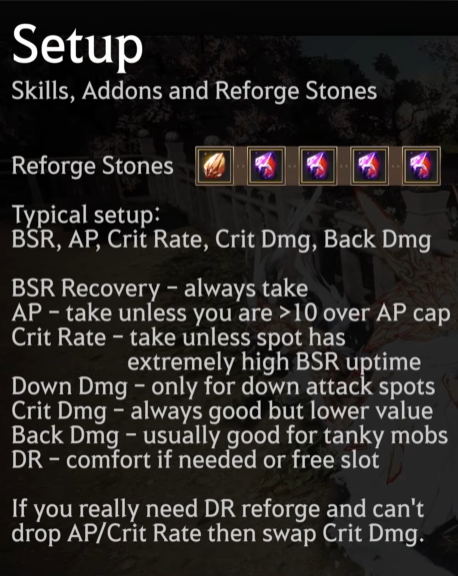

Typical setup: **BSR, AP, Crit Rate, Crit Dmg, Back Dmg.**
- **BSR Recovery** — always take.
- **AP** — take unless you are >10 over AP cap.
- **Crit Rate** — take, extremely high BSR uptime.
- **Down Dmg** — only for down attack spots like Star's End.
- **Crit Dmg** — always good but lower value.
- **Back Dmg** — usually good for tanky mobs.
- **DR** — comfort if needed, or free slot.
- If you really need DR reforge and can't drop AP/Crit Rate, then swap Crit Dmg.

---

## Buffs and Debuffs
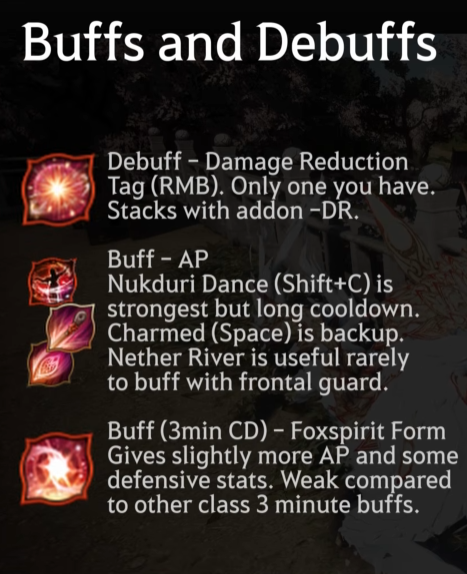

- **Debuff – Damage Reduction Tag (RMB):** only one you have. Stacks with addon -DR.
- **Buff – AP:** Nukduri Dance (Shift+C) is strongest but long cooldown. Charmed (Space) is backup.
  Nether River is useful rarely to buff with frontal guard.
- **Buff (3 min CD) – Foxspirit Form:** gives slightly more AP and some defensive stats. Weak
  compared to other classes' 3-minute buffs.

---

## Infinite Combo (Beginner / Lazy playstyle — "Boring")
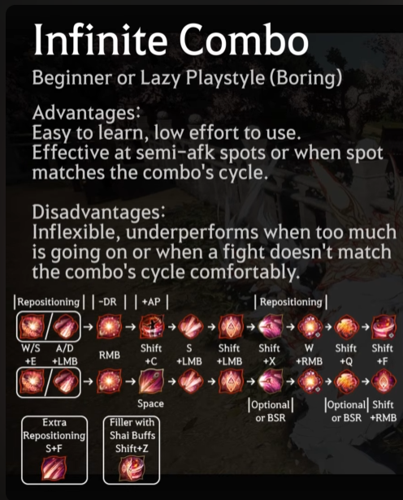
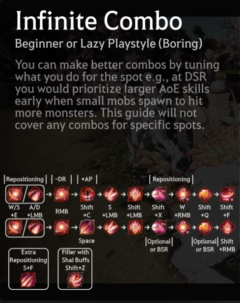

- **Advantages:** easy to learn, low effort to use. Effective at semi-AFK spots or when spot match
  the combo's cycle.
- **Disadvantages:** inflexible; underperforms when you run too much or going on or when a fight
  doesn't match the combo's cycle comfortably.
- You can make better combos by tuning what you do for the spot (e.g. at DSR you'd prioritise larger
  AoE skills early when small mobs spawn to hit more monsters). The guide does not cover combos for
  specific spots.

**Combo (icon-by-icon, infinite loop):**
```
[Reposition] W/S+E or A/D+LMB → [-DR] RMB → [+AP] Shift+C → S+LMB → Shift+LMB
  → [Reposition] Shift+X → W+RMB → Shift+Q → Shift+F (alt: Shift+RMB)
Extra repositioning: S+F      Filler with Shai buffs: Shift+Z
```
> Transcription corrected 2026-06-11: an earlier transcription wrote `W+Q` (Soul Tear) where the
> slide (`combo-infinite-breakdown.png`, zoomed) clearly shows `Shift+Q` (Foxflare) — which also
> matches the Discord full combo exactly. The slide also shows `Shift+RMB` as an alternative final
> skill to `Shift+F`.

### Example without Optional/BSR skills
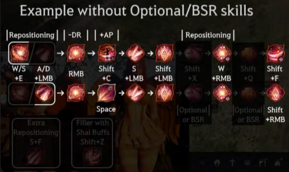
```
[Reposition] W/S+E or A/D+LMB → [-DR] RMB → [+AP] Shift+C / Space → S+LMB → Shift+LMB
  → [Reposition] Shift+X → W+RMB → Shift+Q → Shift+F
```
(Optional-or-BSR slots: Shift+X and Shift+Q.)

### Example including Optional/BSR skills
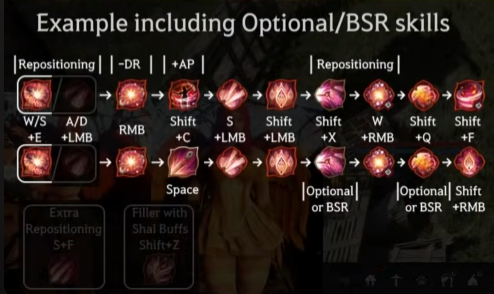
(Same skeleton, with the optional/BSR skills added in the marked "Optional or BSR" slots.)

### Notes on the infinite combo
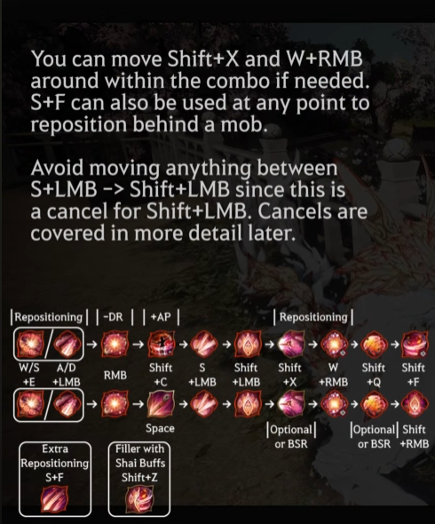
- You can move **Shift+X** and **W+RMB** around within the combo if needed.
- **S+F** can also be used at any point to reposition behind a mob.
- **Avoid moving anything between S+LMB → Shift+LMB**, since this is a cancel for Shift+LMB. Cancels
  are covered in more detail later.

---

## Priority List / Freestyle (Active playstyle — "More fun")
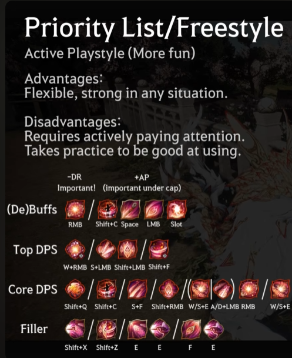
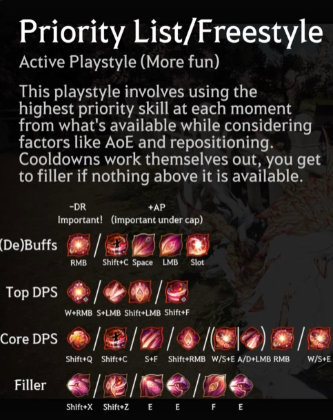

- **Advantages:** flexible, strong in any situation.
- **Disadvantages:** requires actively paying attention; takes practice to be good at using.
- **Note** (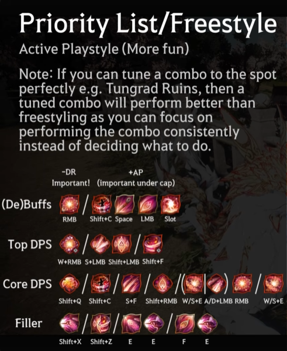): if you can tune a combo to the
  spot perfectly (e.g. Tungrad Ruins), a tuned combo performs better than freestyling, since you focus
  on performing the combo consistently instead of deciding what to do.

**Priority layout (apply -DR first!):**
- **(De)Buffs:** -DR Important → RMB. +AP (important under cap) → Shift+C, Space, LMB, Slot.
- **Top DPS:** W+RMB, S+LMB, Shift+LMB, Shift+F.
- **Core DPS:** Shift+Q, Shift+C, S+F, Shift+RMB, A/D+LMB, RMB.
- **Filler:** Shift+X, Shift+Z, E, E.

---

## Animation Cancels (more FPS = faster, "FPS per second")
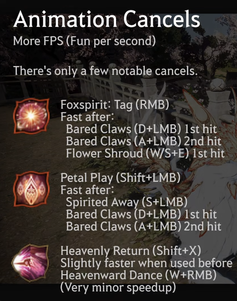

- **Foxspirit Tag (RMB)** — faster after Bared Claws (A/D+LMB) / Flower Shroud (W/S+E).
- **Petal Play (Shift+LMB)** — faster after Bared Claws (A/D+LMB) / Spirited Away (S+LMB).
- **Heavenly Return (Shift+X)** — slightly faster when used before Heavenward Dance (W+RMB). (Very
  minor speedup.)

---

## Movement ("Gotta go fast")
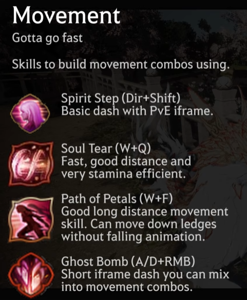
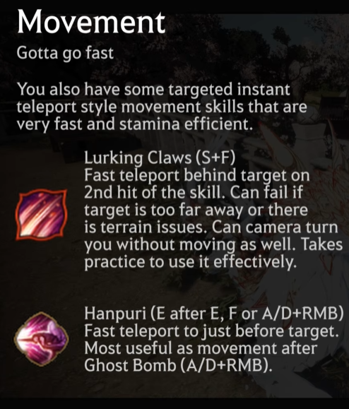

Skills to build movement combos with:
- **Spirit Step (Dir+Shift):** basic dash with PvE iframe.
- **Soul Tear (W+Q):** fast, good distance, very stamina efficient.
- **Path of Petals (W+F):** good long-distance movement; can go down ledges without falling animation.
- **Ghost Bomb (A/D+RMB):** short iframe dash you can mix into movement combos.

Targeted instant-teleport movement skills (very fast, stamina efficient):
- **Lurking Claws (S+F):** fast teleport behind target on 2nd hit of the skill. Can fail if target is
  too far away or terrain issues. Can camera-turn you without moving as well. Takes practice to use
  effectively.
- **Hanpuri (E after E, F, or A/D+RMB):** fast teleport to just before target. Most useful as
  movement after Ghost Bomb (A/D+RMB).

**Example long-distance movement combo** (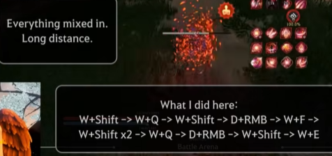):
```
W+Shift → W+Q → W+Shift → D+RMB → W+F → W+Shift x2 → W+Q → D+RMB → W+Shift → W+E
```

**Teleport input tips:**
- **S+F** (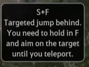): targeted jump behind — hold F
  and aim on the target until you teleport.
- **D+RMB → E** (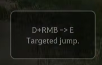): targeted jump.
- **E → E** (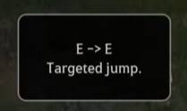): targeted jump.
- **A+RMB → E** (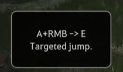): targeted jump.

---

## Repositioning (for back attacks & avoiding damage)
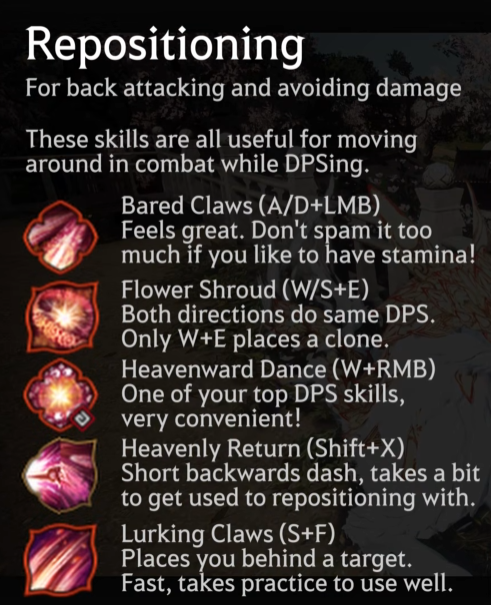

These skills are all useful for moving around in combat while DPSing:
- **Bared Claws (A/D+LMB):** feels great; don't spam too much if you like to have stamina.
- **Flower Shroud (W/S+E):** both directions do some DPS. Only W+E places a clone.
- **Heavenward Dance (W+RMB):** one of your top DPS skills, very convenient.
- **Lurking Claws (S+F):** short backwards dash; takes a bit to get used to for repositioning.

### Clone swap
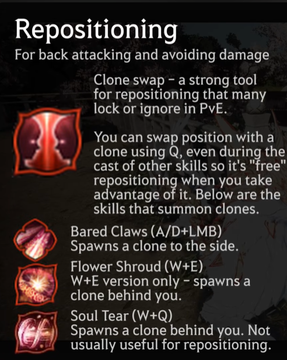
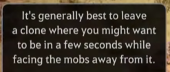

Clone swap is a strong repositioning tool many ignore in PvE. You can swap position with a clone
using **Q**, even during the cast of other skills, so it's "free" repositioning when you take
advantage of it. Skills that summon clones:
- **Bared Claws (A/D+LMB):** spawns a clone to the side.
- **Flower Shroud (W+E):** spawns a clone behind you. Not usually useful for repositioning.
- **Soul Tear (W+Q):** spawns a clone behind you. Not usually useful for repositioning.

Tip: it's generally best to leave a clone where you might want to be in a few seconds, while facing
the mobs away from it.

---

## Tips & Resources
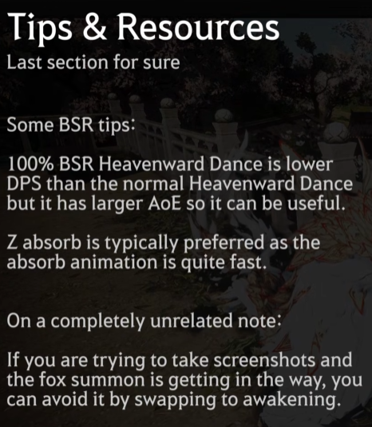
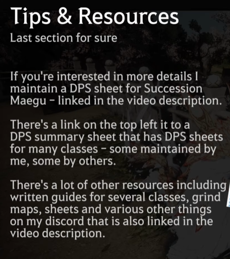

**BSR tips:**
- 100% BSR Heavenward Dance is lower DPS than normal Heavenward Dance, but has larger AoE so it can
  be useful.
- Z absorb is typically preferred, as the absorb animation is quite fast.
- Unrelated: if the fox summon gets in the way when taking screenshots, swap to Awakening to avoid it.

**Resources:**
- Author maintains a **DPS sheet for Succession Maegu** (linked in video description — this is our
  Google Sheet).
- There's a link (top-left in video) to a **DPS summary sheet covering many classes** — some
  maintained by the author, some by others.
- Other resources (written guides, grind maps, sheets) are on the author's Discord, also linked in
  the video description.
